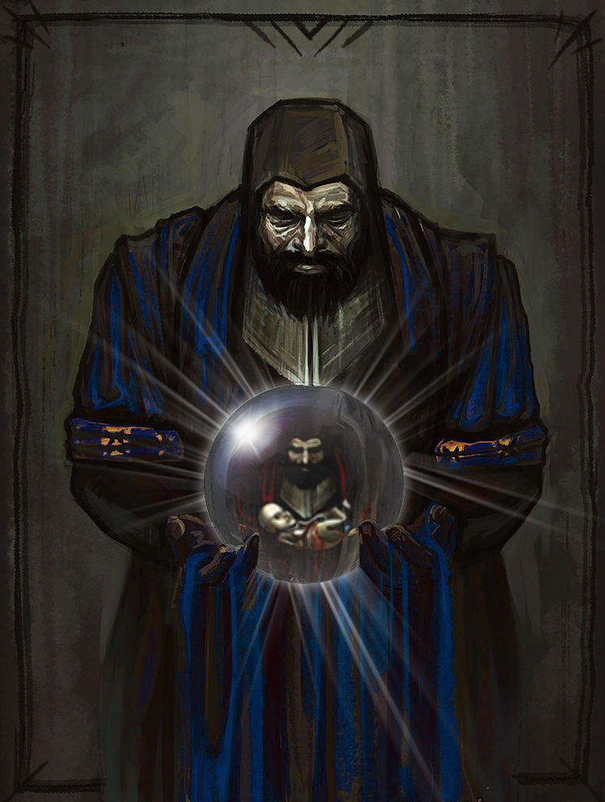

# Blue Baron

<p align="center">
	
</p>

Blue Baron is a set of [modules](https://www.terraform.io/docs/modules/index.html) for [Terraform](https://www.terraform.io/) which tries to automate creating resilient, disposable, secure and agile monitoring infrastructure for Blue Teams.

# Author and Acknowledgments
Authors: John Torakis ([@operatorequals](https://github.com/operatorequals)), Giannis Christinakis ([@gian2dchris](https://github.com/gian2dchris))

The initial inspiration for this comes from the below blog posts:
* Beat's blog post on Cloud-Native Kubernetes SIEM - 
[Security Sky-Gazing](https://build.thebeat.co/security-sky-gazing-16cf158a759a)
* SpecterOps' HELK blog post - 
[What the HELK? SIGMA integration via Elastalert](https://posts.specterops.io/what-the-helk-sigma-integration-via-elastalert-6edf1715b02)
* Security Shenanigans' on *Building an open-source SIEM* - 
[Building an open-source SIEM: combining ELK, Wazuh HIDS and Elastalert for optimal performance](https://medium.com/bugbountywriteup/building-a-siem-combining-elk-wazuh-hids-and-elastalert-for-optimal-performance-f1706c2b73c6)

The name and the artwork are based on [byt3bl33d3rs' *Red-Baron*](https://github.com/byt3bl33d3r/Red-Baron), the Mecca of Red Team Infrastructure.


# Setup

**Blue Baron works with Terraform version 0.12.x or newer.** 

### Elastic on Cloud Kubernetes (ECK) - Operator
ECK operator is the first step to set up Blue Baron infrastructure.
It is common to all providers, from managed cloud K8s clusters to bare-metal clusters and `minikube`.

### ECK Installation

Install ECK, either with `all-in-one.yaml` (https://www.elastic.co/guide/en/cloud-on-k8s/current/k8s-deploy-eck.html):
```bash
kubectl apply -f https://download.elastic.co/downloads/eck/1.2.1/all-in-one.yaml
```
or by downloading the Helm Chart:
```bash
git clone https://github.com/elastic/cloud-on-k8s/
helm install elastic-operator cloud-on-k8s/deploy/eck-operator -n elastic-system --create-namespace 
```

# License

The Blue Baron repository is licensed under the GNU General Public License v3.0.